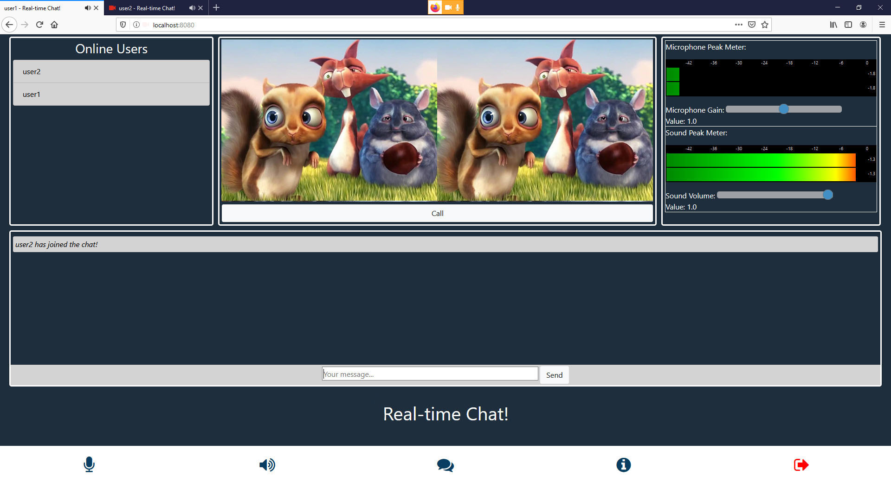

<h3 align="center">Read Time Chat with input / output gains (aka microphone and sound volume), Web Audio Meters and more.</h3>


## Languages and Tools
 </a> 
 </a> 
 </a> 
<br>
Web Audio Peak Meters by git user [esonderegger](https://github.com/esonderegger/web-audio-peak-meter)


## Usage
Download and install Node.js. 
After the installation is complete, install the following packets using the following commands:
```
npm install socket.io
npm install express
npm install ent
```

To run the app follow the following steps:

1. Run appRun.bat
1. Insert the name of the first user on the browser tab that have been launched
1. Open one more tab and go to http://localhost:8080/
1. After you have two tabs opened, just click the call button

## Screenshot


